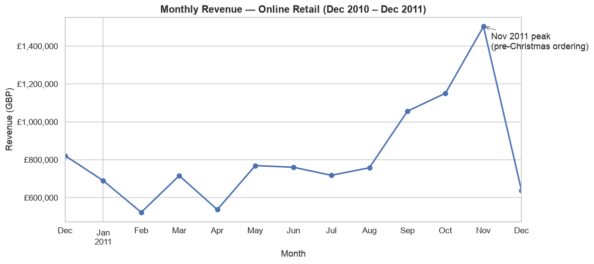
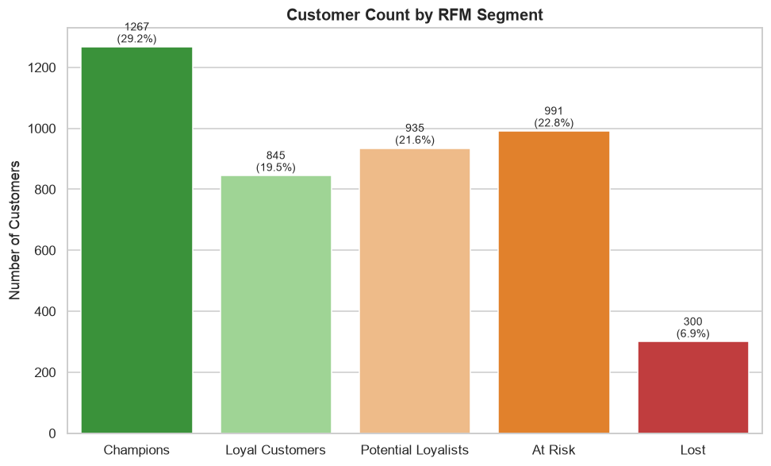

# Retail Data Pipeline

A portfolio project demonstrating two halves of a real data role on a single
real-world dataset:

1. **Data Engineering** — an `extract → transform → load → validate` pipeline
   (`src/etl/`) that downloads a real ~540k-row transaction dataset, cleans it
   with documented, testable rules, loads it into a normalized SQLite
   database, and runs a data-quality suite that fails the run on bad data.
   The whole thing is orchestrated as an **Apache Airflow DAG** with per-stage
   tasks, a daily schedule, and retries on the network-bound stage.
2. **Data Analysis** — a Jupyter notebook (`notebooks/analysis.ipynb`) that
   queries the cleaned data to answer real business questions: sales
   trends, top products/countries, and customer segmentation via RFM
   (Recency, Frequency, Monetary) analysis.

## Dataset

[UCI "Online Retail" Data Set](https://archive.ics.uci.edu/dataset/352/online+retail) —
541,909 real, anonymized transactions from a UK-based, registered, non-store
online retailer between 01-Dec-2010 and 09-Dec-2011. Columns: `InvoiceNo`,
`StockCode`, `Description`, `Quantity`, `InvoiceDate`, `UnitPrice`,
`CustomerID`, `Country`.

The raw file is **not** committed to this repository (it's ~23MB) — `src/etl/extract.py`
downloads it directly from the UCI archive into `data/raw/` on first run, so the
whole pipeline is reproducible from a fresh clone.

## Project Structure

```
retail-data-pipeline/
├── dags/
│   └── retail_etl_dag.py   # Airflow DAG: extract >> transform >> load >> validate
├── src/etl/
│   ├── extract.py          # Downloads raw dataset into data/raw/
│   ├── transform.py        # Cleaning functions (testable, documented decisions)
│   ├── load.py             # Loads cleaned data into SQLite via SQLAlchemy
│   ├── quality.py          # Data-quality checks; raises DataQualityError on failure
│   ├── stages.py           # File-based stage wrappers shared by the DAG and the CLI
│   └── pipeline.py         # Plain-Python runner for all four stages, with logging
├── tests/
│   ├── test_transform.py   # 21 unit tests for the cleaning logic
│   └── test_quality.py     # 41 unit tests for the data-quality checks
├── notebooks/
│   └── analysis.ipynb      # Sales trends, top products/countries, RFM segmentation
├── outputs/figures/        # Saved chart PNGs (viewable on GitHub without running code)
├── data/
│   ├── raw/                # Downloaded raw .xlsx (gitignored)
│   ├── interim/            # Cleaned Parquet handoff artifact (gitignored)
│   └── processed/          # Cleaned SQLite DB (gitignored, regenerate via pipeline.py)
├── .airflow/               # AIRFLOW_HOME for local runs (gitignored)
├── requirements.txt
├── pytest.ini
├── LICENSE
└── README.md
```

## Data Engineering: Pipeline Architecture

The pipeline runs as four independently retryable Airflow tasks. Each stage
reads its input from a file or the database and writes its output to a file or
the database, so no stage depends on another's in-memory state:

```
   Airflow DAG: retail_etl   (schedule: @daily, catchup: off, max_active_runs: 1)

   ┌───────────┐     ┌──────────────┐     ┌────────────┐     ┌──────────────┐
   │  extract  │ ──> │  transform   │ ──> │    load    │ ──> │   validate   │
   │           │     │              │     │            │     │              │
   │ download  │     │ clean rules, │     │ write 3    │     │ 8 data-      │
   │ raw .xlsx │     │ dedupe, calc │     │ tables via │     │ quality      │
   │ from UCI  │     │ TotalPrice   │     │ SQLAlchemy │     │ checks       │
   └───────────┘     └──────────────┘     └────────────┘     └──────────────┘
   retries: 3          retries: 1           retries: 1          retries: 1
   (exp. backoff)
        │                   │                    │                   │
        v                   v                    v                   v
   data/raw/           data/interim/       data/processed/      raises on
   online_retail       clean_retail        retail.db            failure ->
   .xlsx               .parquet            (customers,          run marked
                                            products,            FAILED
                                            transactions)

   Handoff between tasks is by artifact, not memory. Only small JSON
   metadata (paths, row counts) travels over Airflow XCom.
```

Every task uses Airflow's default `all_success` trigger rule, so a failure
anywhere leaves the remainder of the chain `upstream_failed` and marks the DAG
run failed — nothing downstream of a bad stage executes.

The same four stages also run without Airflow via `python -m src.etl.pipeline`.
Both entrypoints call the identical functions in `src/etl/stages.py`, so there
is one implementation of each stage and the two paths cannot drift apart.

**Cleaning decisions** (see full docstring in `src/etl/transform.py`):

| Rule | Rationale |
|---|---|
| Drop invoices starting with `C` (cancellations) | Represent returns, not completed sales |
| Drop non-positive `Quantity` / `UnitPrice` | Stock adjustments / free items, not paid sales |
| Drop rows with missing `Description` | No usable product info; overlaps heavily with £0 adjustment rows |
| **Keep** rows with missing `CustomerID` | Real sales from guest checkouts (~25% of rows) — flagged with `is_guest`, excluded only from customer-level (RFM) analysis |
| Drop exact duplicate rows | Data entry duplication |
| Compute `TotalPrice = Quantity * UnitPrice` | Needed for all revenue analysis |

**Schema** (SQLite, `data/processed/retail.db`):
- `customers(customer_id PK, country)`
- `products(stock_code PK, description)`
- `transactions(id PK, invoice_no, stock_code FK, customer_id FK nullable, quantity, unit_price, total_price, invoice_date, country, is_guest)`

A lightweight star-schema (one fact table + two dimension tables) — enough
structure to demonstrate normalization without over-engineering a dataset
this size.

## Orchestration (Apache Airflow)

`dags/retail_etl_dag.py` defines the `retail_etl` DAG. The DAG file contains
**no ETL logic** — each task is a thin call into `src/etl/stages.py`, so the
orchestrator contributes scheduling, retries, dependency ordering and failure
semantics and nothing else.

| Setting | Value | Why |
|---|---|---|
| `schedule` | `@daily` | Daily refresh cadence |
| `catchup` | `False` | The source is a fixed historical archive; backfilling every day since `start_date` would re-run identical work |
| `max_active_runs` | `1` | The load stage replaces tables wholesale, so concurrent runs would race on the same SQLite file |
| `trigger_rule` | `all_success` (default, all tasks) | Downstream tasks do not run if an upstream task failed |

**Retry policy.** Retries are targeted rather than uniform. `extract` is the
only task that touches the network, so it carries the real retry budget:
**3 retries with exponential backoff**, starting at 30s (→60s→120s) and capped
at 5 minutes, with a 15-minute execution timeout. The other three tasks are
deterministic local compute over files already on disk — retrying them would
usually just re-run the same failure — so they get a single retry to absorb a
transient filesystem or lock blip.

Verified configuration as parsed by Airflow:

```
task       retries  retry_delay   exp_backoff  max_retry_delay  trigger_rule  upstream
extract    3        0:00:30       True         0:05:00          ALL_SUCCESS   []
transform  1        0:00:30       False        None             ALL_SUCCESS   ['extract']
load       1        0:00:30       False        None             ALL_SUCCESS   ['transform']
validate   1        0:00:30       False        None             ALL_SUCCESS   ['load']
```

### Why the stages pass data through files

Airflow runs every task in its own process, and XCom is backed by the metadata
database — it is a channel for small scalars, not for bulk data, so pushing a
525k-row DataFrame through it would be an anti-pattern. Instead:

- `transform` writes `data/interim/clean_retail.parquet`; `load` reads it.
- `load` writes the SQLite DB; `validate` reads it.
- Only small JSON dicts (file paths, row counts, durations) cross XCom.

Parquet is used rather than CSV because it round-trips the dtypes the pipeline
depends on exactly — the nullable `Int64` CustomerID, the `datetime64`
InvoiceDate, and the boolean `is_guest` flag all survive a write/read cycle,
whereas CSV would degrade them to strings and force error-prone re-parsing.

### Run the DAG locally (from a fresh clone)

```bash
git clone https://github.com/chaitanya2404/retail-data-pipeline.git
cd retail-data-pipeline

python3 -m venv .venv
source .venv/bin/activate          # Windows: .venv\Scripts\activate
pip install -r requirements.txt

# Point Airflow at this repo instead of ~/airflow
export AIRFLOW_HOME="$PWD/.airflow"
export AIRFLOW__CORE__DAGS_FOLDER="$PWD/dags"
export AIRFLOW__CORE__LOAD_EXAMPLES=False

airflow db migrate                 # one-time: create the metadata DB
airflow dags test retail_etl       # run all four tasks end to end
```

`airflow dags test` executes the whole DAG in-process and is the quickest way
to prove it works; it needs no scheduler or webserver running. To inspect a
finished run task-by-task:

```bash
airflow dags list-runs retail_etl
airflow tasks states-for-dag-run retail_etl <run_id>
```

To use the web UI instead (scheduler + API server + UI on
<http://localhost:8080>):

```bash
airflow standalone
```

Standalone generates an `admin` password on first start, prints it to the
console, and stores it in `.airflow/simple_auth_manager_passwords.json.generated`.
That file — and the whole `.airflow/` directory — is gitignored and must never
be committed. Note the DAG is created **paused**; unpause it in the UI or with
`airflow dags unpause retail_etl` before the scheduler will run it.

## Data Quality

`src/etl/quality.py` runs after the load stage. Any failing check raises
`DataQualityError`, which fails the `validate` task and therefore the DAG run.
All eight checks run every time, so one run reports every problem rather than
stopping at the first. Each check reports the value it actually measured, not
just pass/fail.

| Check | What it asserts | What it guards against |
|---|---|---|
| `row_count_in_range` | 400,000 ≤ rows ≤ 600,000 | Empty or truncated load (download served an error page, transform dropped everything), or a duplicated load doubling the fact table |
| `no_nulls_in_required_columns` | 0 nulls in `invoice_no`, `stock_code`, `quantity`, `unit_price`, `total_price` | Rows that cannot be attributed to an invoice, product or price, which would silently corrupt every downstream aggregate. Also fails if a required column is missing entirely |
| `no_non_positive_quantity_or_price` | No `quantity <= 0` or `unit_price <= 0` | The cleaning rules silently failing to apply — cancellations, refunds and £0 stock adjustments leaking into the fact table and distorting revenue |
| `fk_transactions_customer_id` | Every non-null `customer_id` exists in `customers` | Orphaned facts from a broken dimension build, which would make RFM silently drop or misattribute revenue |
| `fk_transactions_stock_code` | Every `stock_code` exists in `products` | Orphaned product references breaking product-level reporting and dimension joins |
| `revenue_finite_and_positive` | `SUM(total_price)` is finite and > 0 | NaN/inf contamination propagating into headline figures — a single `inf` makes reported revenue meaningless |
| `total_price_matches_quantity_times_price` | `\|total_price − quantity × unit_price\| ≤ 0.01` | A derived column drifting out of sync with its inputs, e.g. a partial reload updating quantity but not total_price |
| `invoice_date_within_expected_window` | All dates parseable, within 2010-12-01 → 2011-12-31, none in the future | Date parsing failures (epoch-zero or `NaT` rows) and clock/timezone bugs producing future-dated rows |

`customer_id` is deliberately **excluded** from the null check: ~25% of rows
are guest checkouts with no customer key, which is a documented property of
this dataset (see `transform.py` decision #5), not a defect.

**On "freshness":** the last check is a *range* check, not a conventional
freshness check. The Online Retail dataset is a fixed 2010–2011 archive, so
asserting "data is recent" would fail by construction and would be a
dishonest check to ship. The meaningful invariants for a static source are
that every date parses, sits inside the expected historical window, and that
nothing is dated in the future.

**Why hand-rolled rather than a library.** This was an install-compatibility
decision, measured rather than assumed, on Python 3.14 / pandas 3.0.5:

- **Great Expectations** only resolves by *downgrading* pandas to 2.3.3 and
  numpy to 1.26.4. Adding a quality tool that regresses the library the whole
  pipeline is built on is a bad trade.
- **soda-core** resolves but downgrades `requests`, and is built around YAML
  scan definitions against a configured warehouse — a lot of configuration
  surface for eight checks.
- **Pandera** installs cleanly and suits column/schema rules well, but half
  the checks here are cross-table referential integrity and aggregate
  invariants over SQLite, which sit outside its schema model.

The checks are plain pandas over ~525k rows and complete in about 0.7s.

## Setup

```bash
python3 -m venv .venv
source .venv/bin/activate   # Windows: .venv\Scripts\activate
pip install -r requirements.txt
```

### Run the pipeline (without Airflow)

```bash
python -m src.etl.pipeline
```

This downloads the raw dataset (if not already present in `data/raw/`),
cleans it, writes `data/processed/retail.db`, and validates the result. Each
stage logs its row counts and duration — real output from a run:

```
=== STAGE 1/4: EXTRACT ===
Extract complete: data/raw/online_retail.xlsx (22.62 MB) in 0.00s
=== STAGE 2/4: TRANSFORM ===
Transform complete: 541909 -> 524876 rows (17033 dropped, 3.1%) in 11.53s
=== STAGE 3/4: LOAD ===
Load complete: {'customers': 4338, 'products': 3922, 'transactions': 524876} in 3.58s
=== STAGE 4/4: VALIDATE ===
[PASS] row_count_in_range: actual=524876 | expected between 400,000 and 600,000 rows
[PASS] no_nulls_in_required_columns: actual=0 nulls across 5 columns
[PASS] no_non_positive_quantity_or_price: actual=0 rows with quantity<=0, 0 rows with unit_price<=0
[PASS] fk_transactions_customer_id: actual=0 orphan customer_id values (0 rows); 4338 distinct ids checked against 4338 customers
[PASS] fk_transactions_stock_code: actual=0 orphan stock_code values (0 rows); 3922 distinct codes checked against 3922 products
[PASS] revenue_finite_and_positive: actual=10641558.95 | expected finite total revenue > 0
[PASS] total_price_matches_quantity_times_price: actual=0 rows exceed tolerance; max abs diff 0.001000
[PASS] invoice_date_within_expected_window: actual=min=2010-12-01 08:26:00, max=2011-12-09 12:50:00; 0 before window, 0 after window, 0 in the future, 0 unparseable/null
--- 8/8 checks passed (0 failed) ---
=== PIPELINE COMPLETE in 15.81s ===
```

The `extract` stage is idempotent — it reuses the already-downloaded raw file,
which is why it reports 0.00s above. Delete `data/raw/online_retail.xlsx` (or
pass `force_download=True`) to re-download.

Running the same work through Airflow produces the same numbers:

```
dag_id      task_id    state    start_date                        end_date
retail_etl  extract    success  2026-08-14T21:23:30.250193+00:00  2026-08-14T21:23:31.161738+00:00
retail_etl  transform  success  2026-08-14T21:23:31.172220+00:00  2026-08-14T21:23:42.485619+00:00
retail_etl  load       success  2026-08-14T21:23:42.492502+00:00  2026-08-14T21:23:45.395376+00:00
retail_etl  validate   success  2026-08-14T21:23:45.401857+00:00  2026-08-14T21:23:46.202928+00:00
```

### Run the tests

```bash
pytest
```

62 tests: 21 covering every cleaning rule in `transform.py`, and 41 covering
the data-quality checks in `quality.py`. Both suites use small inline sample
DataFrames rather than the full dataset, so the whole run takes under a
second. Every quality check is tested with both a passing and a
deliberately-failing case, so the suite proves the checks actually catch bad
data rather than only returning PASS on good data.

### Open the analysis notebook

```bash
jupyter notebook notebooks/analysis.ipynb
```

The notebook connects to `data/processed/retail.db` (run the pipeline first),
so run it top-to-bottom after `python -m src.etl.pipeline`. All charts are
also pre-rendered as PNGs in `outputs/figures/` for viewing without running
anything.

## Data Analysis: Key Findings

*(Computed from the real, cleaned dataset — 524,876 order lines, 4,338
identified customers, Dec 2010 – Dec 2011.)*

1. **Revenue & scale.** The cleaned dataset totals **£10,641,558.95** in
   revenue across **19,960 invoices**. 541,909 raw rows were reduced to
   524,876 clean rows (3.1% dropped — cancellations, invalid
   quantities/prices, or missing descriptions).
2. **Seasonality.** Revenue peaks in **November 2011 at £1,503,329.78** —
   nearly triple the February 2011 low of £522,545.56 — consistent with
   pre-Christmas ordering. December 2011 is a partial month in the source
   data (cut off on the 9th).
3. **Geographic concentration.** **84.6% of revenue (£9,001,192)** comes
   from the United Kingdom; every other country contributes under 3%
   individually — the Netherlands, EIRE (Ireland), Germany, and France are
   the next largest markets.
4. **Top products.** Beyond shipping/adjustment line items, the top
   physical product by revenue is the **REGENCY CAKESTAND 3 TIER
   (£174,156.54)**, followed by **PAPER CRAFT, LITTLE BIRDIE
   (£168,469.60)** and the iconic **WHITE HANGING HEART T-LIGHT HOLDER
   (£106,415.23)**.
5. **Customer value is highly concentrated.** RFM segmentation of the 4,338
   identified customers found **1,267 "Champions" (29.2% of customers)**
   generating **76.8% of total customer revenue** — a textbook Pareto
   pattern. The single largest customer contributed **£280,206.02** across
   73 orders. **300 customers (6.9%) are "Lost"** — a concrete win-back
   marketing target.
6. **Order economics.** Average order value is **£533.14** (median
   £303.30); the mean/median gap points to a right-skewed distribution
   driven by large wholesale-style orders.

**Business takeaways:** prioritize retention spend on the ~1,267 Champions
(≈77% of revenue), build a win-back campaign for the ~300 Lost customers,
and treat non-UK markets as a growth opportunity given how concentrated
revenue currently is domestically.

### Charts

**Monthly revenue trend:**



**Customer segments (RFM):**



See `outputs/figures/` for all 6 charts (monthly & weekly revenue, top
products, top countries, RFM segment distribution, RFM scatter plot) and
`notebooks/analysis.ipynb` for the full analysis with commentary.

## Tech Stack

Apache Airflow · pandas · SQLAlchemy · SQLite · Parquet (pyarrow) ·
matplotlib · seaborn · pytest · Jupyter

Verified on Python 3.14.5 / macOS arm64 with Airflow 3.3.1 and pandas 3.0.5.

## License

MIT — see [LICENSE](LICENSE).
